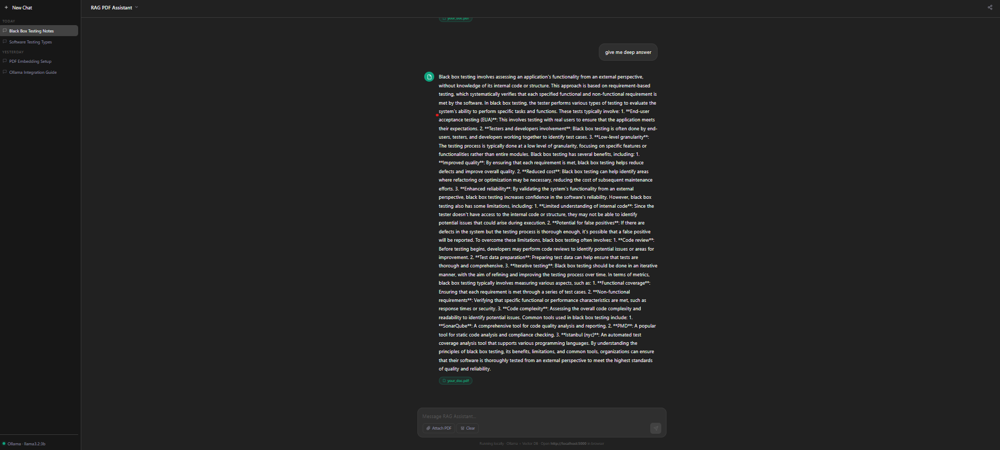

# RAG PDF Assistant

A local Retrieval-Augmented Generation (RAG) app for asking questions over PDF notes.

## Preview



Demo video: [video.mp4](video.mp4)

## What It Does

- Extracts text from PDFs in `data/`
- Splits content into chunks
- Creates embeddings with SentenceTransformers
- Stores vectors in ChromaDB
- Answers questions through a Flask API backed by Ollama

## Architecture

User Uploads PDF
       │
       ▼
 PDF Text Extraction (pdf.py)
       │
       ▼
 Text Chunking (chunks.py)
       │
       ▼
 Embedding Generation (embedding.py)
       │
       ▼
 Vector Storage (vector_db/)
       │
       ▼
 User Asks Question
       │
       ▼
 Query Embedding → Similarity Search → Relevant Chunks Retrieved
       │
       ▼
 LLM generates Answer using retrieved context (app.py)
       │
       ▼
 Answer returned to User
 
## Tech Stack

- Backend: Python, Flask
- PDF parsing: PyMuPDF (`fitz`)
- Embeddings: `all-MiniLM-L6-v2`
- Vector store: ChromaDB
- LLM: Ollama `llama3.2:1b`

## Run Locally

```powershell
.\ENV\Scripts\Activate.ps1
pip install -r requrement.txt
python app.py
```

Open `http://localhost:5000` in your browser.

## Project Files

- `app.py` - API and answer generation
- `pdf.py` - PDF text extraction
- `chunks.py` - text chunking
- `embedding.py` - vector creation
- `index.html` - frontend UI

## Note

If your image file is named `image.pns`, rename it to `image.png` so the README preview works.
